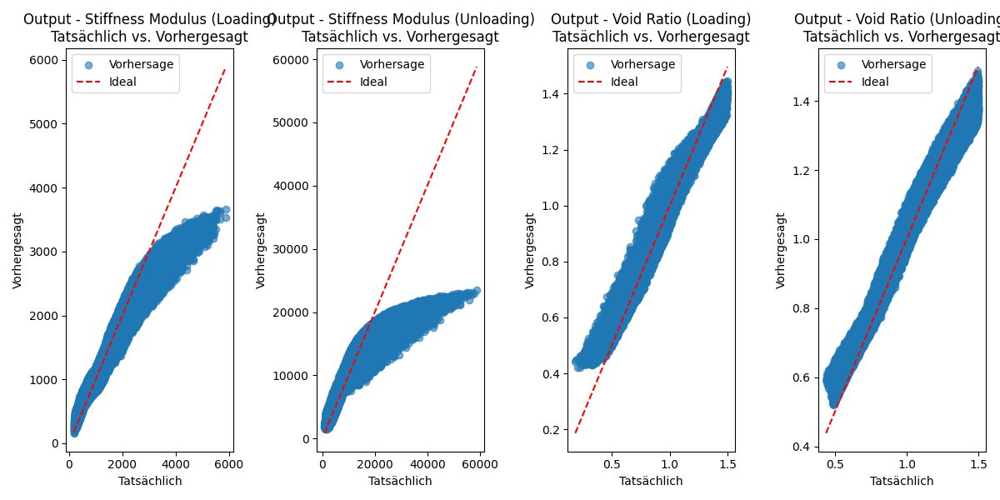

# Ödometerversuch mit KI-Unterstützung

Dieses Projekt untersucht die Anwendung von KI-Modellen zur Vorhersage von bodenmechanischen Parametern aus dem Ödometerversuch. Es kombiniert klassische geotechnische Berechnungen mit maschinellem Lernen, um Prozesse zu automatisieren und Muster in Daten zu erkennen.

## Projektübersicht
Der **Ödometerversuch** wird genutzt, um das Setzungs- und Konsolidationsverhalten von Böden zu analysieren. Ziel dieses Projekts ist es, eine KI zu entwickeln, die auf Basis von Versuchsdaten Parameter wie Porenzahlen oder Steifemodule vorhersagen kann.

### Features:
- Generierung von Testdaten mit realistischen Wertebereichen für Input-Parameter.
- Berechnung klassischer bodenmechanischer Parameter aus dem Ödometerversuch.
- Vorbereitung für die Integration von KI-Modellen zur Vorhersage von Zielwerten.

---

## Verzeichnisstruktur
- **`main.py`**: Hauptskript zur Berechnung und Simulation von Testdaten.
- **`handleTestValues.py`**: Generierung realistischer Input-Parameter für den Ödometerversuch.

---

## Input- und Output-Parameter

### Input-Parameter (Einflussgrößen):
1. **Kompressionsbeiwert (Cc):** Verdichtungseigenschaften bei Belastung (0,1 ≤ Cc ≤ 0,5).
2. **Schwellbeiwert (Cs):** Elastizitätseigenschaften bei Entlastung (0,01 ≤ Cs ≤ 0,1).
3. **Anfangs-Porenzahl (e0):** Hohlraumdichte des Bodens (0,5 ≤ e0 ≤ 1,5).
4. **Effektive Anfangsspannung (σ0'):** Anfangsdruck im Boden (50 ≤ σ0' ≤ 200 kN/m²).
5. **Zusatzspannung (Δσ):** Aufgebrachte Spannung (10 ≤ Δσ ≤ 100 kN/m²).

### Output-Parameter (Berechnungen):
1. **Mittlere Spannung (σmittel):** σmittel = σ0' + Δσ/2.
2. **Steifemodul bei Belastung (Es, Belastung):** (1 + e0) / Cc * σmittel.
3. **Steifemodul bei Entlastung (Es, Entlastung):** Analog mit Cs.
4. **Porenzahlen (e, Belastung und e, Entlastung):** Berechnet über logarithmische Beziehungen.


---

## Nächste Schritte
- Integration eines maschinellen Lernmodells zur Vorhersage von Output-Parametern basierend auf realen Versuchsdaten.
- Validierung des Algorithmus mit echten Testwerten aus Ödometerversuchen.
- Optimierung der Parameterbereiche und Verbesserung der Datenqualität.

___

## Ersten Ergebnisse

```
Training Progress:  10%|█         | 10/100 [00:29<04:22,  2.91s/it]
Epoch [10/100], Loss: 0.5519
Training Progress:  20%|██        | 20/100 [00:58<03:55,  2.94s/it]
Epoch [20/100], Loss: 0.3779
Training Progress:  30%|███       | 30/100 [01:28<03:25,  2.93s/it]
Epoch [30/100], Loss: 0.3096
Training Progress:  40%|████      | 40/100 [01:57<02:54,  2.91s/it]
Epoch [40/100], Loss: 0.2736
Training Progress:  50%|█████     | 50/100 [02:26<02:29,  2.99s/it]
Epoch [50/100], Loss: 0.2536
Training Progress:  60%|██████    | 60/100 [02:56<01:58,  2.96s/it]
Epoch [60/100], Loss: 0.2415
Training Progress:  70%|███████   | 70/100 [03:26<01:28,  2.96s/it]
Epoch [70/100], Loss: 0.2350
Training Progress:  80%|████████  | 80/100 [03:55<00:58,  2.92s/it]
Epoch [80/100], Loss: 0.2311
Training Progress:  90%|█████████ | 90/100 [04:25<00:29,  2.98s/it]
Epoch [90/100], Loss: 0.2301
Training Progress: 100%|██████████| 100/100 [04:54<00:00,  2.95s/it]

Epoch [100/100], Loss: 0.2294
Test Loss: 0.0898
Output - Stiffness Modulus (Loading):
  Tatsächlich: 2088.79, Vorhergesagt: 2136.39
Output - Stiffness Modulus (Unloading):
  Tatsächlich: 5409.88, Vorhergesagt: 5779.84
Output - Void Ratio (Loading):
  Tatsächlich: 1.40, Vorhergesagt: 1.34
Output - Void Ratio (Unloading):
  Tatsächlich: 1.41, Vorhergesagt: 1.33
MSE: 2255266.5000
MAE: 435.5664
R2: 0.9106
```


