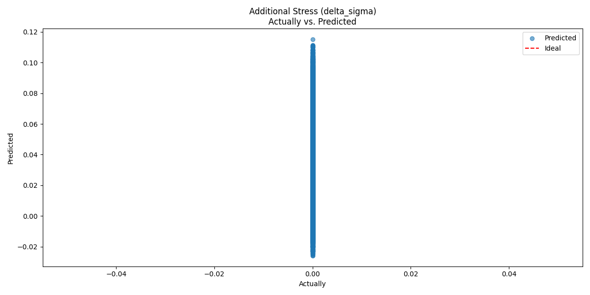

# Ödometerversuch mit KI-Unterstützung

Dieses Projekt untersucht die Anwendung von KI-Modellen zur Vorhersage von bodenmechanischen Parametern aus dem Ödometerversuch. Ziel ist es, Prozesse zu automatisieren und präzisere Vorhersagen über das Verhalten von Böden unter Belastung zu treffen.

## Projektübersicht

Der **Ödometerversuch** wird verwendet, um das Setzungs- und Konsolidationsverhalten von Böden zu analysieren. Dieses Projekt kombiniert traditionelle geotechnische Modelle mit einem neuronalen Netzwerk, das auf synthetischen Testdaten trainiert wird.

### Features
- **Automatische Generierung von Testdaten**: Werte basieren auf typischen geotechnischen Spannungs- und Deformationsbereichen.
- **Neural Network Training**: Konfigurierbare Modelle für die Vorhersage spezifischer geotechnischer Parameter.
- **Evaluation und Visualisierung**: Statistiken und Plots, um die Modellleistung zu bewerten.

---

## Verzeichnisstruktur

- **`main.py`**: Hauptskript für Datengenerierung und Modelltraining.
- **`handleTestValues.py`**: Generierung realistischer geotechnischer Parameter.
- **`handleNeuralNetwork.py`**: Definition, Training und Evaluation des neuronalen Netzwerks.
- **`handleDataframes.py`**: Datenmanipulation und Speicher-/Lade-Operationen.
- **`classProblemObjects.py`**: Definiert die Problemstruktur für Böden.

---

## Input- und Output-Parameter

### Input-Parameter:
1. **Compression Index (Cc):** Maß für Verdichtbarkeit (0.1 ≤ Cc ≤ 0.5).
2. **Swelling Index (Cs):** Maß für elastische Erholung (0.01 ≤ Cs ≤ 0.1).
3. **Initial Stress (σ₀):** Anfangsspannung im Boden (50 ≤ σ₀ ≤ 200 kN/m²).
4. **Strain Increment (Δε):** Deformationsinkrement (0.0001 ≤ Δε ≤ 0.01).

### Output-Parameter:
- **Additional Stress (Δσ):** Spannungsänderung, die aus dem Deformationsinkrement resultiert.

---

## Konfigurationsoptionen

Die Datei `config/config.ini` erlaubt die Anpassung der folgenden Parameter:
- **Netzwerkarchitektur**: Hidden Layer, Aktivierungsfunktionen und Dropout-Raten.
- **Training**: Lernrate, Epochen, Scheduler-Typ und Early Stopping.
- **Datenverarbeitung**: Normalisierung, Datenaugmentation und Split-Verhältnisse.

---

## Nächste Schritte
- **Integration realer Daten**: Validierung des Modells mit experimentellen Werten.
- **Optimierung des Modells**: Verbesserung der Vorhersagegenauigkeit durch Hyperparameter-Tuning.
- **Erweiterte Visualisierung**: Darstellung von Spannungs-Dehnungs-Kurven und Modellprognosen.

---

## Beispielausgabe
Konsole:
```plaintext
Starting the neural network process and overwriting the existing model (trainOnStartup is True)...
Training Progress:  10%|█         | 10/100 [00:06<00:54,  1.64it/s]
Epoch [10/100], Loss: 0.0734
Training Progress:  20%|██        | 20/100 [00:12<00:43,  1.83it/s]
Epoch [20/100], Loss: 0.0428
Training Progress:  30%|███       | 30/100 [00:17<00:38,  1.80it/s]
Epoch [30/100], Loss: 0.0312
Training Progress:  40%|████      | 40/100 [00:23<00:37,  1.60it/s]
Epoch [40/100], Loss: 0.0242
Training Progress:  50%|█████     | 50/100 [00:29<00:27,  1.80it/s]
Epoch [50/100], Loss: 0.0198
Training Progress:  60%|██████    | 60/100 [00:35<00:24,  1.65it/s]
Epoch [60/100], Loss: 0.0173
Training Progress:  70%|███████   | 70/100 [00:41<00:16,  1.78it/s]
Epoch [70/100], Loss: 0.0157
Training Progress:  80%|████████  | 80/100 [00:46<00:11,  1.68it/s]
Epoch [80/100], Loss: 0.0150
Training Progress:  90%|█████████ | 90/100 [00:52<00:06,  1.63it/s]
Epoch [90/100], Loss: 0.0147
Training Progress: 100%|██████████| 100/100 [00:58<00:00,  1.71it/s]

Epoch [100/100], Loss: 0.0147
Test Loss: 0.0004
Additional Stress (delta_sigma):
  Actually: 0.00, Predicted: -0.01
MSE: 0.0004
MAE: 0.0143
R2: 0.0000
Plot saved to ./output/predictions.jpeg
Model saved to ./output/model.pth
```
Plot: 
